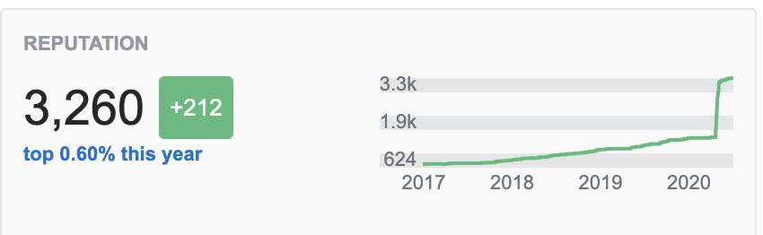

# Five Lessons from refactoring StackOverflow code that will make your JS coding journey 253% easier

A repo to go with the BrisJS talk "_Five Lessons from refactoring StackOverflow code_" (video link coming soon...).

## Background

In early 2020, I noticed that my worldwide ranking on StackOverflow had dropped, and I was only in the top 25% in the world. 

Unacceptable.

I went on a burn, and I'm now back in the top 0.60% - where I belong. ;-)

When you expose yourself to a vast amount of data in a short period of time, patterns start to emerge. 

I noticed that 80% of questions in the JavaScript tag on StackOverflow had the same fundamental problems.

They required much deeper refactors than the answer "_How do I get this code to work_", so they were really out of scope for an answer. 

To capture them somewhere, I started a category on my blog called "[StackOverflowed](https://www.joshwulf.com/categories/stackoverflowed/)" where I described the deeper issues, and refactored them.

In the BrisJS talk, I cover the top five things that, I believe, will most improve your JS programming; and did a live refactor of a question from StackOverflow.

## The Five Things (and one bonus)

### 0. Let vs Var vs Const

Use `const` for _everything_. Anything that is left is part of a state machine, and should be encapsulated.

Understand that arrays and objects, and should be declared as `const`, even if you push to them. And if you push to an array, it's a state machine.

See the article [Shun the Mutant](https://www.joshwulf.com/blog/2020/02/shun-the-mutant/) on my blog.

### 1. Global Mutable State

Any genuine variables represent actual mutable state - which is rare in a program. Things like time, the state of the network connection, a current score, are variables. And they belong in state machines with immutable-value returning interfaces. See [01-global-mutable-state.js](01-global-mutable-state.js), and the article [Avoid Global State]( https://www.joshwulf.com/blog/2020/02/avoid-global-state/) on my blog.

### 2. Loops

Loops are state machines. When you solve a problem using a loop, now you have two problems. 

Mostly, people thing "I have to do something to every element in this array", and construct a loop.

However, what you need to do is "do something to each element in this array" - which means a function and Array.map. 

See the article [Why Array.map](https://www.joshwulf.com/blog/2020/03/why-array-map/) on my blog.

### 3. Data transformation

Niklaus Wirth wrote the classic book "[Algorithms + Data Structures = Programs](https://en.wikipedia.org/wiki/Algorithms_%2B_Data_Structures_%3D_Programs)" in 1976.

A lot of programming is transforming data structures. If you are doing a lot of complex transformations, revisit the data structures.

If you don't control input data structures (for example, you consume them for a web service you don't control), then you will have to transform them.

If you find yourself writing a loop and using Array.push, you should be doing Array.map.

Correctly and accurately naming your data structures, intermediate data structures, and transformer functions will make the Dao clear.

See the article [Providing a Semantic API](https://www.joshwulf.com/blog/2020/02/providing-a-semantic-api/
) on my blog.

### 4. Promises

A lot of JS programming is async. A common problem is "retrieve some data from a service, make some determinations based on that data, then retrieve some other data, return that data to the caller".

In this case, you want Promise.all, Array.map, and Array.filter.

See the article [Handling Failure and Success in an Array of Asynchronous Tasks](https://www.joshwulf.com/blog/2020/03/array-async-failure/) on my blog.

### Bonus: Naming

80% of programming is naming things. When things are correctly named, the Dao becomes clear.

## Live Refactoring a StackOverflow Question

In the BrisJS talk, I refactored a StackOverflow question live. It was the third question on the page in the JavaScript tag when I went on there, and demonstrates many of the factors that I cover.

The question that I refactored is [here](https://stackoverflow.com/questions/61724541/array-of-promises-in-a-promise-array/61727830#61727830).

You can see it in [demo.js](demo.js), along with stub code to mock the services returning the remote data structures.

To run it: `node demo.js`.

A refactor with no loops and no variables is in [refactor.js](refactor.js).

To run it: `node refactor.js`.
